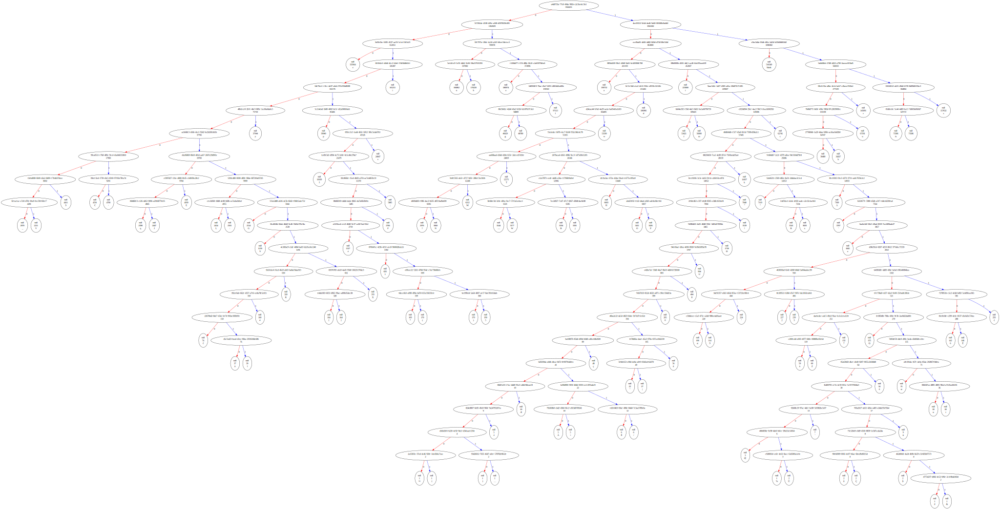

### This is a Kotlin implementation of a Compression Tool using Huffman encoding/decoding.

##### Basics of compression:

1. Read the file and determine the frequency of each character occurring.
2. Build the binary tree from the frequencies.
3. Generate the prefix-code table from the tree.
4. Encode the text using the code table.
5. Encode the tree - included in the output file so we can decode it.
6. Write the encoded tree and text to an output file

##### Basics of decompression:

1. Read the file and retrieve header and body.
2. Convert to binary
3. Replace body with codewords
4. Convert from bits to ByteArray
5. Write decompressed file.

###### Huffman Tree generated by test.txt file:

References:
https://opendsa-server.cs.vt.edu/ODSA/Books/CS3/html/Huffman.html
https://opendsa-server.cs.vt.edu/ODSA/Books/CS3/html/Huffman.html

Implementation inspired by John Crickett -> https://codingchallenges.fyi/challenges/challenge-huffman/
